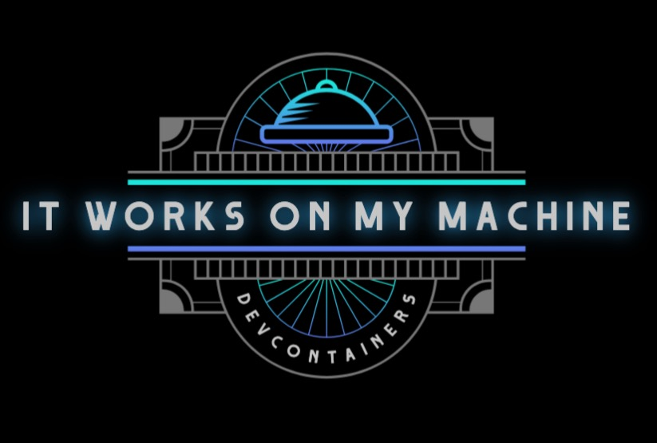

# it-works-on-my-machine



This repository demonstrates a basic setup for development containers using Python, Node.js, and Golang. Each language has a "Hello, World!" example that you can run within the respective dev containers.

## Prerequisites

- [Docker](https://www.docker.com/)
- [Visual Studio Code](https://code.visualstudio.com/) with the [Remote - Containers extension](https://marketplace.visualstudio.com/items?itemName=ms-vscode-remote.remote-containers)

## Supported Languages

- [Python](#python)
- [Node.js](#nodejs)
- [Golang](#golang)

## Usage

1. Clone this repository:

   ```bash
   git clone https://github.com/GirishCodeAlchemy/it-works-on-my-machine.git
   ```

2. Open the repository in Visual Studio Code:

   ```bash
   cd it-works-on-my-machine
   code .
   ```

3. When prompted, click on "Reopen in Container" to open the project inside a development container.

4. Run the examples:

   - **Python:**

     ```bash
     python sample_python.py
     ```

   - **Node.js:**

     ```bash
     node sample_node.js
     ```

   - **Golang:**

     ```bash
     go run sample_golang.go
     ```

   - **Multi-container Support**

     To test multi-container setups, you can use the provided `docker-compose.yml` file. It includes configurations for Python, Node.js, and Golang services.

     1. Ensure Docker Compose is installed.

     2. Run the following command:

        ```bash
        docker-compose up
        ```

## Contributing

Feel free to contribute to this repository by adding more examples, improving documentation, or making it more versatile for different development environments.
